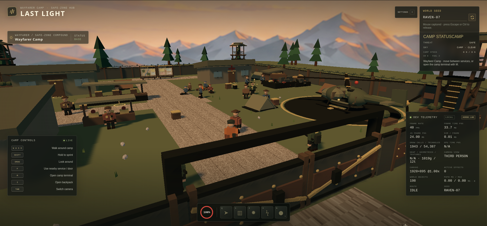
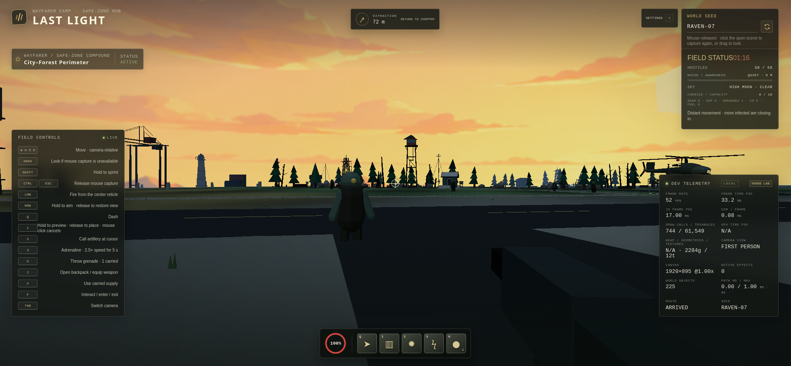
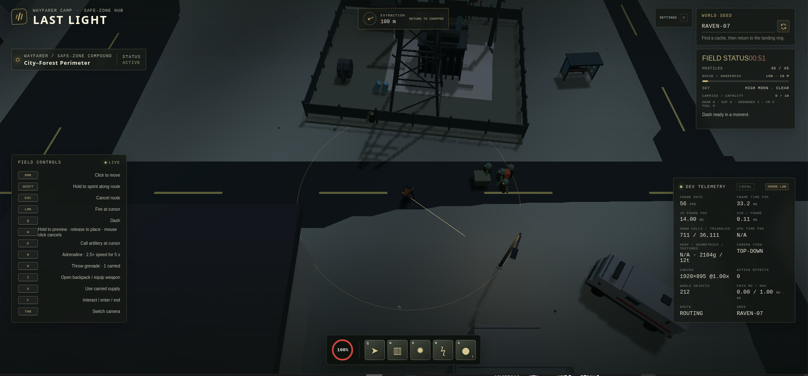

# Last Light

A single-player survival and extraction game about scavenging a zombie-overrun region and making it back to a safe camp. Built with TypeScript and Three.js.

Explore six seeded environments, fight or evade a growing horde, search enterable buildings, and decide what is worth carrying to extraction. Between runs, manage a walkable survivor camp with shops, storage, upgrade services, lookout towers, and a waiting helicopter.

## Screenshots

**Wayfarer Camp — third-person view**



**In the field — first-person view**



**In the field — top-down view**



## Highlights

- Three camera views: third person, top-down, and first person.
- Seeded maps with four orientations and six connected region themes.
- A scalable horde with distant dormant enemies, noise awareness, and up to 10,000 tracked agents.
- Persistent item-list inventory, Armory and connected skill tree shared between camp and missions; extraction saves carried gear, while death puts it at risk.
- Enterable, repeatable building interiors, weather and lighting presets, and authored low-poly environments.

## Run the game

Install [Node.js](https://nodejs.org/) 22.12+ (or 20.19+) and npm 10+, then run:

```sh
npm ci
npm run dev
```

Open the local address printed by Vite in a desktop browser with WebGL2 support.

## Quick controls

Move with **W/A/S/D**. In top-down view, right-click to move and left-click an enemy once to keep attacking it until it dies, or click an interactable to use it. In perspective views, hold right mouse for a closer aimed view and release to restore it; drag-to-look is available when pointer lock is blocked. Press **Tab** to cycle views and **F** to interact. **Q** dashes; **W/E/R** (top-down) or **1/2/3** (perspective) use abilities. **I** opens the backpack, **G** throws a carried grenade, and **O** opens atmosphere and accessibility settings.

Press **Esc** to pause the world and open **Last Light → Resume Game / Settings / Exit Game**. Settings include master, sound effects, and weather/ambience volume sliders, plus a blood toggle; preferences persist. **O** and the Settings button open the same paused settings page. Exit returns to the title screen, abandoning an unfinished sortie while preserving banked camp progress. Play Game returns to camp.

## Possible future additions

Possible additions include new destinations, more enemy families, and additional vehicles.

For contribution and development details, see the [developer guide](docs/development.md).

## Phase 18 playtest

Phase 18 is awaiting owner review. **I** opens the item list; at camp, use **Armory** to choose a permanently unlocked firearm and **Skill Tree** to pan/zoom the connected upgrade web. The handgun and one grenade are the starter kit. SMG/M4A unlocks cost 100/150 banked credits. Each successful extraction grants a skill point; first-clear optional objectives grant extra points only on extraction. Skill-point reassignment at camp is free and preserves permanent firearms. Grenade charges refill free at deployment.

At the parked chopper, **F** opens sortie choices; **M** provides the same departure through the camp terminal. Standard is free. High-yield costs 2 banked fuel, has twice the reachable crates/enemy population and reinforcement pace, and better loot. Hire a companion for 40 credits for the next run. Seeded alarms and occasional stranded survivors offer optional risks and extraction rewards. Rescued residents join camp only after boarding successfully. **F** at the south gate opens/closes it; follow the exterior path back to camp.

- Verify Esc pauses movement, enemies, timers, extraction, weather and audio; Settings stays paused, volumes/blood persist after reload, Resume continues, and Exit returns to the title screen.
- Check held aim/release in third and first person, top-down right-click movement, single-click enemy lock before and after the 12-second grace period while zombies chase, and distinct handgun/SMG/M4A sound at rapid-fire rates.
- Buy connected nodes, inspect costs/previews, select a weapon, extract, reload, die, and respec; confirm banked progression persists and early unlock pacing feels fair.
- Verify two/three free grenade refills, larger blast, bounded non-stacking fire, and character/turret/companion upgrades.
- Compare standard/high-yield previews and counts; confirm fuel is spent once on deployment and is not returned on death. Standard must remain available at zero fuel.
- Escort a hired companion and a rescued survivor through a building and to extraction; confirm local defense ignores distant idle threats and leaving a survivor behind grants no roster/reward.
- Stand still and verify scout noise decays to 0 m even while an alarm is active; walking/sprinting sustain 10/20 m and nearby zombies react to scout noise.
- Disable an alarm, verify local calming and extraction-only credits/first-clear point, and inspect the recruited resident's camp contribution.
- Cross the camp gate in both directions, revisit services, and check hills, tree collision, return path, mission panorama/fog, close-only ground dressing and coastal waves in every camera view.
- Confirm extraction works before 60 seconds while the floating arrow stays hidden, then appears at 60 seconds. Review high-yield frame rate on the reference desktop, especially with companions and fire.
