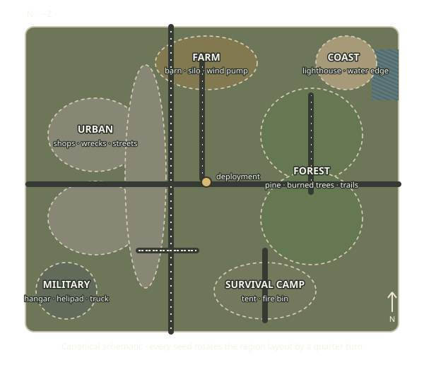

# Greywood's seeded regions

Greywood keeps the original city–forest run and adds four outer region themes. The map generator builds the region layout before placing assets, then rotates districts, routes, landmarks, loot zones, placements, and the shoreline together from the run seed. `PHASE13-00` through `PHASE13-03` cover the four quarter-turn orientations.

The schematic shows the unrotated layout. North is negative Z; the deployment point is near the center. Region footprints overlap at their edges to form transition areas. Farm, military, coast, and camp themes occupy their own contiguous footprints, while the city and forest each join multiple districts into a larger region.

| Theme         | Eligible runtime assets                                                                                                                                                                                                | Terrain and route treatment                               |
| ------------- | ---------------------------------------------------------------------------------------------------------------------------------------------------------------------------------------------------------------------- | --------------------------------------------------------- |
| Urban         | Building shells, damaged row house, burned corner store, ambulance wreck, city bus wreck, totaled car, transit shelter, electrical substation, water treatment tanks, rooftop water tank, scrap station, street lights | Dusty ground and paved streets                            |
| Forest        | Pine trees, boulders, burned tree clusters, fire lookout, ranger cabin, rock outcrop, timber stacks, lookout platform, weather station, wooden power pylon                                                             | Green ground and narrow trails                            |
| Farm          | Barn shell, grain silo, wind pump, water tower, abandoned tractor, oil pumpjack                                                                                                                                        | Dry field ground and farm lane                            |
| Military      | Aircraft hangar, helipad, communications truck, portable floodlight tower, relay mast, radar dish, vehicle checkpoint, barricade gate                                                                                  | Muted field ground and access road                        |
| Coastal       | Lighthouse, dry dock crane, cargo container stack                                                                                                                                                                      | Sandy ground, coastal trail, and a collidable water strip |
| Survival camp | Camping tent, fire bin, boulder, portable generator, abandoned substation                                                                                                                                              | Muted camp ground and narrow track                        |

`src/world/regionThemes.ts` is the placement contract. It lists role-specific weights, per-theme density and spacing, terrain colors, required set pieces, and allowed variant counts. `AssetPlacement` stores a stable theme and region ID separately from the authored asset module. The generator checks map bounds, region membership, road clearance, asset overlap, and collider overlap. It also derives a walkable approach for every authored interaction point and for each regional landmark.

The operations board continues to offer Greywood as the default free destination. The field-base theme is a sector within Greywood; it does not make the later Military Base destination available.

## Regression and owner review

Automated coverage builds the four rotation seeds plus a 16-seed theme batch. Each map includes every required approved set piece; the second 22-model batch adds dedicated urban utility/street dressing, forest and farm landmarks, military checkpoints/radar, coastal port assets, and survival-camp power infrastructure. The abandoned substation uses a separate asset ID backed by the electrical substation's stripped variant. It checks same-seed replay, all six themes, required assets and pool membership, connected elliptical footprints, collision validation, reachable interaction approaches, landmark routes, and seven caches across the themes. One local 24-seed load batch reported **14.24 ms p95, 14.61 ms maximum** world-data generation time. This excludes Three.js scene construction and is not a reference-machine performance claim.

For the owner review, use the [Phase 13 playtest checklist in the README](../README.md#phase-13-playtest-checklist). Check both camera views, all four seed rotations, the coastal water boundary, the approaches and doors, and cache routes. The schematic is a layout guide; the in-game seed remains the source of truth for jittered coordinates and local dressing.
